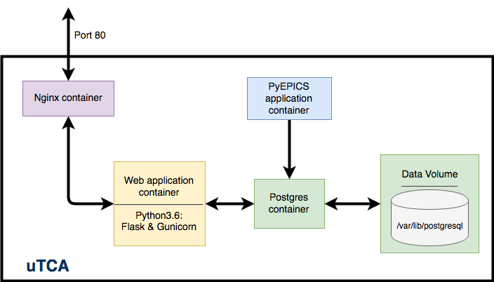

# epics-web-viewer
This is a web application built from containerised services.



## Usage
To start this service, you need to do three things:
* Start the servers
* Initialise the database
* Start the PV-reader service

### Starting the servers
```python
docker-compose build
docker-compose up
```

### Initialise the database
```python
docker-compose run pyepics python3 initialise_db.py
```

### Start the PV service
```python
docker-compose run pyepics bash
python3 main_process.py
```
